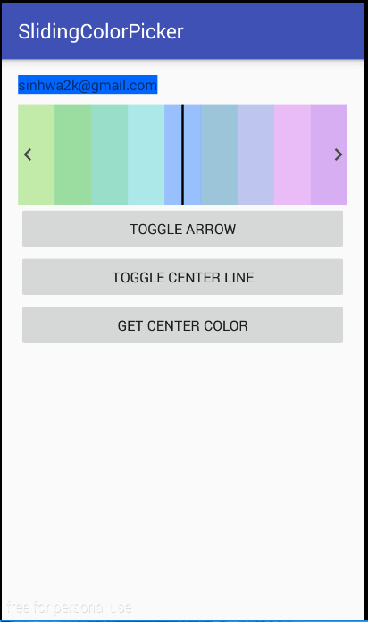

# SlidingColorPicker
SlidingColorPicker




## Settings

#### Android Studio

your layout.xml

```groovy
<com.sinhwa2k.slidingcolorpicker.ColorPickerView
        xmlns:sinhwa2k="http://schemas.android.com/apk/res-auto"
        android:id="@+id/MainActivity_cpv"
        android:layout_width="match_parent"
        android:layout_height="100dp"
        sinhwa2k:color_alpha="100"
        sinhwa2k:visible_arrow="true"
        sinhwa2k:visible_center_line="true"
        sinhwa2k:show_color_count="9"/>
```